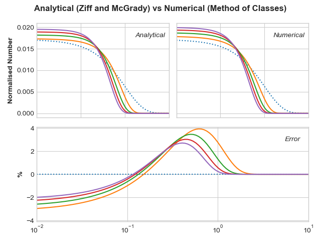

# breakage-population-balance

_Solution to breakage-based population balance equations in python._

Would look to increase the number of equations supported. At the moment this module only supports simple, 1D cases (pure breakage). Currently only solves for fraction, which simplifies calculations for mass/volume based systems.



_Comparison between analytical [(Ziff and McGrady, 1985)](https://www.doi.org/10.1088/0305-4470/18/15/026
) and numerical methods, for 100 classes._

## Usage

The rate and kernel can be passed as callable functions or as numpy arrays. all other fields are passed as numpy arrays. Currently there is only one breakage model, which is simple breakage. I'd like to extend this function to cover an arbitrary number of inputted dimensions (internal and external) before moving on to extending the number of models.

```
from breakage_population_balance import breakageModel
import numpy as np

classes = 100
nt = 100
Tf = 5

x = np.logspace(-2, 1, classes)
t = np.linspace(0, Tf, nt+1)

# rate function
k = lambda x: x**2

# kernel function
def Phi(x, y):
    if x < y:
        pass
    else:
        return 0
    return x / y

# Works on a fraction based approach, so number needs to be converted to
# fraction.
IC = np.exp(-x)*x

# Run and solve the breakage problem
model = breakageModel(IC, t, x, Phi, k)
solution = model.solve()
```
